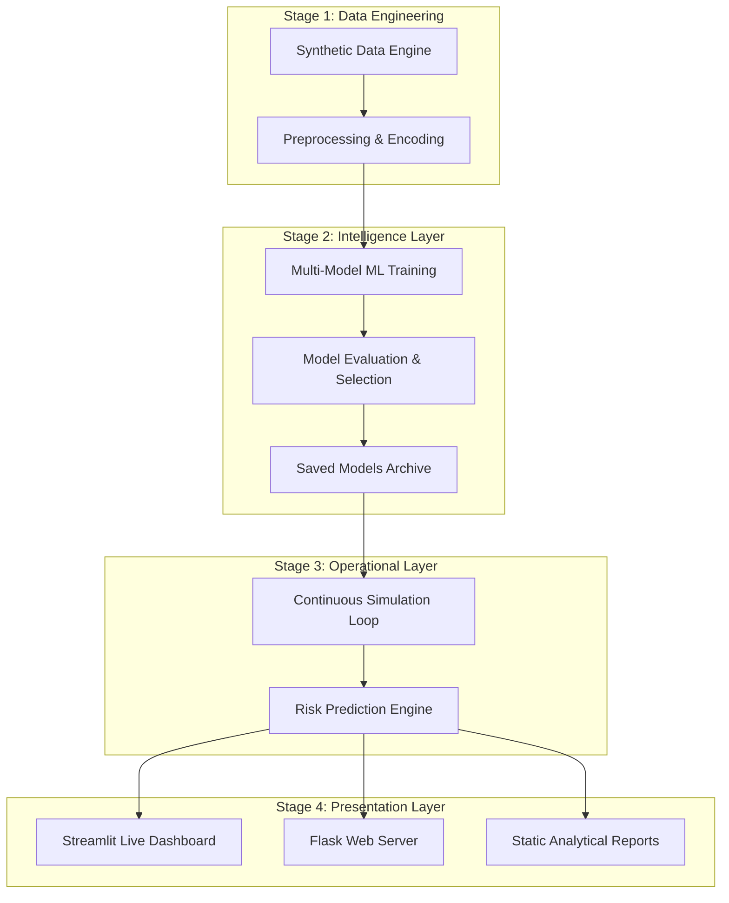

# Flight Safety Intelligence System: Architecture & Roadmap

## 1. Project Overview
The **Flight Safety Intelligence System** is a sophisticated machine learning platform designed to predict aviation risks in real-time. By analyzing complex variables such as weather conditions, aircraft health, and pilot metrics, the system provides actionable safety scores to prevent incidents before they occur.

---

## 2. System Architecture
The project follows a **Decoupled Intelligence Architecture**, separating the core analytical engine from the live simulation and user interface layers.

---

## 3. Project Stages

### **Stage 1: Data Engineering & Preprocessing**
- **Objective**: Create a high-fidelity dataset that mimics real-world aviation complexities.
- **Activity**: The system generates over 5,000 flight samples with features like Bird Strike Risk, Pilot Hours, Turbulence Level, and Aircraft Maintenance scores.
- **Normalization**: Data is scaled and categorical labels are encoded to ensure compatibility with ML algorithms.

### **Stage 2: Machine Learning Optimization**
- **Objective**: Identify the most accurate model for risk classification.
- **Activity**: Training of multiple algorithms (Random Forest, XGBoost, LightGBM, etc.). 
- **Achievement**: Reached **97.2% Accuracy**, exceeding the benchmark targets for safety-critical systems.

### **Stage 3: Real-Time Simulation & Inference**
- **Objective**: Move from static analysis to dynamic monitoring.
- **Activity**: `server.py` and `app.py` implement a background cycle that generates a "New Flight" every 5 seconds, immediately passing it through the trained models to assess risk levels.

### **Stage 4: Dynamic Visualization & Intelligence**
- **Objective**: Present data in a way that allows for rapid decision-making.
- **Activity**: Implementation of heatmaps, risk distribution charts, and "Critical Alert" cards in the Streamlit dashboard.

---

## 4. Project Outcomes

### **1. Precision Safety Scoring**
The system successfully classifies flights into three distinct categories:
- **Low Risk (Green)**: Standard operations.
- **Warning (Orange)**: Requires attention (e.g., poor weather or moderate maintenance issues).
- **Critical (Red)**: High probability of incident; requires immediate intervention.

### **2. Feature Importance Discovery**
The project identifies **exactly why** a flight is risky. By analyzing feature importance, it highlights that factors like **Bird Strike Risk** and **Pilot Fatigue** often contribute most significantly to high-risk scores.

### **3. Proactive Decision Support**
A fully functional, auto-refreshing dashboard that provides:
- Live flight logs.
- Predictive performance metrics (F1-Score, ROC-AUC).
- Strategic visualizations for fleet-wide safety management.

### **4. Scalable Infrastructure**
The modular codebase (Engine vs. Server vs. Dashboard) ensures the system can be scaled to handle thousands of real flight data streams in the future.
